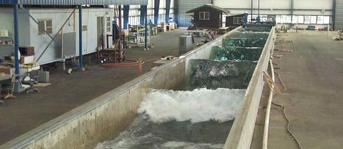

# Dune 3 Validation Project

## Description
The purpose of this project is to Validate FUNWAVE-TVD against the Dune 3 experiment at Oregon State University. Sensitivity analyses are conducted to determine the optimal FUNWAVE-TVD parameters to maximize agreement with the data. 

## Experimental Data Source
This model run corresponds to the Dune 3 experiment at Oregon State University, containing 20 different trials in a ~100 m wave flume with detailed bathymetry, wave gauge, and ADV data available. This was largely a morphodynamics-driven study, so there are profiles collected *before* and *after* the experiment. Since, FUNWAVE-TVD is not a morphodynamic model, only the before values are used.

## Data Characteristics
The data has been pre-processed as described in [Tsai et al (2024)](https://agupubs.onlinelibrary.wiley.com/share/2XFSXHPU9JEWUENXESZB?target=10.1029/2024JC021194) and separated into a *raw* and *filtered* dataset. These were further processed in the NetCDF format by Ryan Schanta for this study, with files for each of the form:

- `filtered/Trial05.nc` (for filtered data)
- `raw/Trial05.nc` (for raw data)

The relevant parameters for the raw and filtered data are described below:

### Raw Data

| **Field Name** |  Significance |
|--|--|
| `WG_loc_x` | Location of wave gages in the x position
| `X_before` | A x-coordinate system for the domain
| `t` | Simulation times, in seconds
| `bed_before` | Bathymetry heights as measured from a 0-datum of the tank's bottom
| `eta` | Values of eta at each position in X corresponding to `r_WG_loc_x` and times `t`
| `t0` | Simulation start time- note there is some 'dead time' in the beginning before sensors activate
| `t_end` | Simulation end time- note there is some "dead time" at the end that should be excluded
| `MWL` | MWL at each position in X corresponding to `r_WG_loc_x` , assumed to be quiscient free surface

### Filtered Data

| **Field Name** |  Significance |
|--|--|
| `loc_x` | Location of wave gages in the x position
| `X_before` | A x-coordinate system for the domain
| `t` | Simulation times, in seconds
| `bed_num_before` | Bathymetry heights as measured from a 0-datum of the tank's bottom
| `eta` | Values of eta at each position in X corresponding to `r_WG_loc_x` and times `t` (PROCESSED)
| `eta_i` | Values of the *incident*  waveform eta at each position in X corresponding to `r_WG_loc_x` and times `t` (PROCESSED)
| `eta_r` | Values of the *reflected*  waveform eta at each position in X corresponding to `r_WG_loc_x` and times `t` (PROCESSED)
| `t0` | Simulation start time- note there is some 'dead time' in the beginning before sensors activate
| `t_end` | Simulation end time- note there is some "dead time" at the end that should be excluded

Clearly, the main difference between the raw/filtered difference is the separation into incident and reflected waves. But it should also be noted that the bathymetry is cleaned a bit- the raw data doesn't take into account the position of a concrete slab in the tank.
