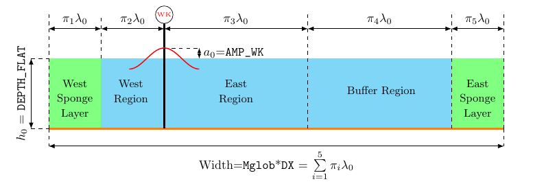

# Flat Tank Model Runs

## Description
The purpose of this project is to assess the effect of various FUNWAVE-TVD model parameters on the propagation of wave energy in an empty tank. Without variable bathymetry, this essentially acts as a sensitivity analysis of FUNWAVE-TVD in its most basic form of operation.

## Basic Model Domain and Setup

All the ensembles in this project are run under the `DEPTH_TYPE=FLAT` mode of FUNWAVE-TVD with a regular wavemaker given by `WK_REG`, defined by a choice of input parameters `Tperiod` and `AMP_WK` for basic operation. Consistent with FUNWAVE-TVD best practices, sponge layers are placed on each end of the domain to dampen wave energy and reflections that may otherwise occur. 

### Regions of the Domain
The domain is split into 5 main regions for each simulation, with others containing more as needed:
1. **West Sponge Layer**: sponge layer 
2. **West Region**: region between the sponge layer and the position set by `Xc_WK`. This region is not of interest, since the direction of propagation is taken *eastward*, although this region must be sufficiently wide for numerical stability.
3. **East Region**: region immediately east of the wavemaker. This is the primary region analyzed, as the primary objective of this project is to assess the wave properties as a function of distance from the wave maker in the propagation direction.
4. **Buffer Region**: region placed after the east region to ensure sufficient distance from the eastern boundary to limit boundary effects.
5. **East Sponge Layer**: sponge layer

### Sizing of the Regions ($\pi$ parameters)
The width of the 5 primary regions is set dynamically for each wave condition, based on a **representative wavelength** $\lambda_0$. This wavelength is calculated from the linear dispersion relationship for the input period `Tperiod` of the wavemaker and the depth `DEPTH_FLAT` of the domain:

$$
\sigma^2 = gk\tanh{kh}
$$

where:
- $\sigma=\frac{2\pi}{T}$: the intrinsic angular frequency, which is just related to the period `Tperiod` for this setup
- $h$: the depth of water, taken as `DEPTH_FLAT` in this setup
- $g$: gravity (9.81 m/s^2)

The representative wavelength is then taken as:

$$
\lambda_0 = \frac{2\pi}{k}
$$

The width of each layer is set as a multiple of $\lambda_0$ based on the objectives of this study and FUNWAVE-TVD best practices. These distances in wavelengths are defined by the dimensionless $\pi$ groups:

|Layer|$\pi$ |Value|Rationale|
|:--|:--|:--|:--|
|West Sponge Layer|$\pi_1$|4| Torres (2022)- sponges should be at least one wavelength thick |
|West Region|$\pi_2$|1| Torres (2022)- the distance between the wavemaker and sponge should be at least one wavelength thick|
|East Region|$\pi_3$|50| Long enough to examine wave statistics as a function of distance|
|Buffer Region|$\pi_4$|100| Long enough to be far from the eastern sponge to avoid boundary effects|
|East Sponge Layer|$\pi_5$|4| Torres (2022)- sponges should be at least one wavelength thick|

## Other Parameters

### $\tau$ Parameters: Setting the Temporal Domain Dynamically
Nondimensional times are set by $\tau$ parameters, which represent multiples of the some characteristic period $T_0$. Note that for the regular wavemaker, the clear characteristic period to use is just `Tperiod`. The only relevant time scale to set in this study is `TOTAL_TIME`, controlling the simulation length:

|Time Scale|$\tau$ |Value|Rationale|
|:--|:--|:--|:--|
|Total Simulation Time|$\tau_1$|150| Enough to get a steady state|

### $\xi$ Parameters: Setting Hydrodynamic Parameters Dynamically
Nondimensional parameters related to wave theory are denoted by $\xi$ parameters. It also may make sense to set some parameters based on hydodynamic constraints. 

|Parameter|$\xi$ |Value|Rationale|
|:--|:--|:--|:--|
|$\epsilon=\frac{a}{h}$|$\xi_1$|0.05| Very linear waves, at least at generation|
|$\mu=kh$|$\xi_2$|$<\pi$| Within the limits of FUNWAVE-TVD|

## Directory of Experiments
- `DX_Sens`: Sensitivity anlaysis of grid spacing `DX`
- `Time_Sens`: Sensitivity analysis of `TOTAL_TIME` on the calculation of wave statistics
- `CD`: Sensitivity analysis of the `CD` bottom friction parameters

