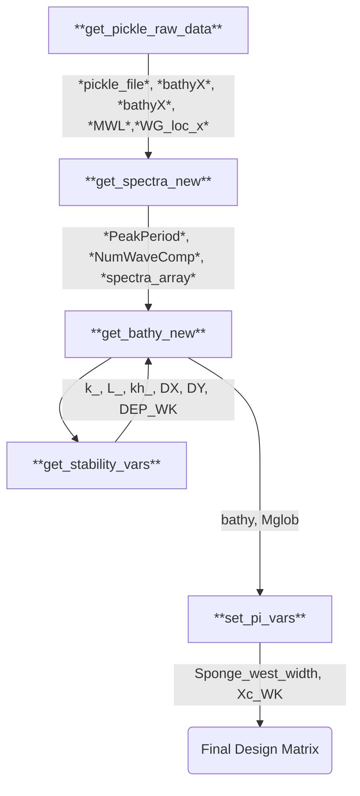

# DUNE 3: D3e1 Design Matrix

## Purpose/Motivation
The purpose of this run will be to assess the effect of different preprocessing pipelines on the accuracy of Dune 3 Validation, with a focus on the general time series as well as its accuracy in the swash region. Consequently, several preprocessing pipelines are used.

## Schematic
There are a few different schematics considered here:

## Input Parameters and Preprocessing
### Custom Input Design Parameters
- **pi_1**: position of the wavemaker from the western edge, in multiples of the representative wavelength lambda. This is set as 1.0 for now.
- **pi_2**: width of the sponge layer, in multiples of the representative wavelength $\lambda$. This is set as 0.5 for now.

### Custom Input Support Parameters
- **DATA_DIR**: Directory where each pickled file for the Dune3 data can be found. Use for bathymetry
### Ranged Parameters

### List Parameters
- **D3_TRIAL**: Trial of Dune 3 Data Used, either 5 or 20.
- **D3_DataType**: Type of Dune 3 data used, either filtered or raw

## Data Sources
Dune 3 Trials 5 and 20 are the focus of this data set/
## Preprocessing Pipelines

### For the Raw Data
The RAW data from the trials is obtained, and the spectra at the westernmost gauge is obtained. The standard stability limits are considered to set grid spacing. If necessary, distance is added to the left of the domain to allow there to be one whole wavelength between the western edge and the wavemaker (estimated via linear dispersion)

### Custom Dependent Parameters

## Filter Functions

## Plots generated
Plots of the bathymetry/domain are generated.

## Input Files Printed
- **input.txt**: Necessary FUNWAVE input file
- **DEP_FILE.txt**: A bathymetry input file is generated for each trial

## Postprocessing
### Condensing Raw Binaries to Larger Files
All inputs and outputs are output to the `.tfrecord` data format for use in ML applications. I plan to expand this to a more convenient, self-describing HDF5 and NetCDF format as well in the future

### Postprocessing Functions Applied

### Plots/Videos Generated
Animations of the wave field are automatically generated for all trials.