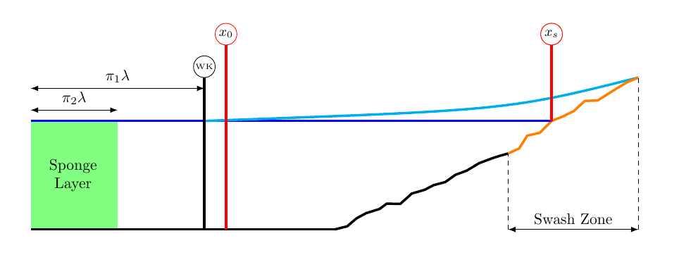
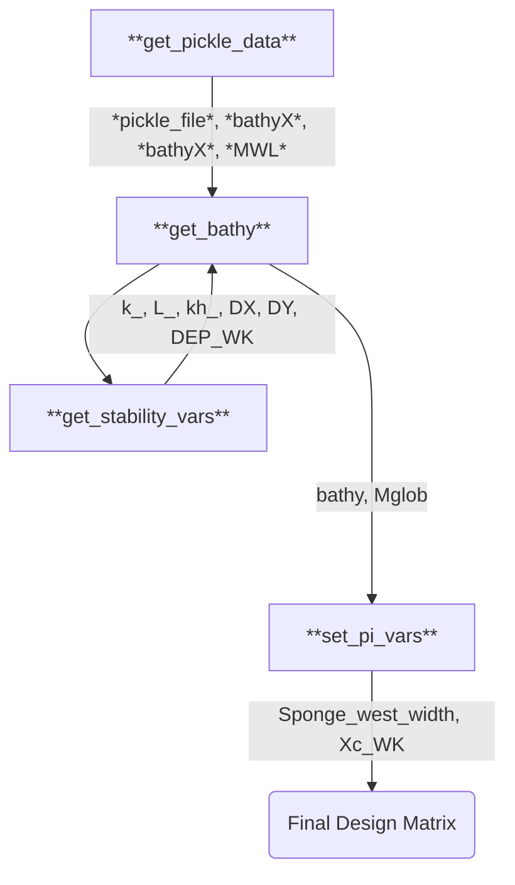
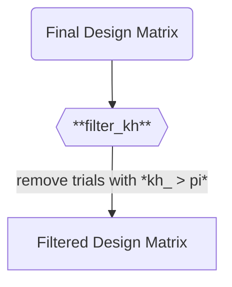

# DUNE 3: SW1 Design Matrix

## Purpose/Motivation
This dataset will be used to examine the ability to map offshore time series around the position of the wavemaker time series in the swash region. Bathymetry from the Dune 3 dataset will be used. A regular wavemaker will be used.

## Schematic

We are interested in getting using the free surface elevation $\eta_0$ time series at $x_0$ near the wavemaker to predict a time series free surface elevation $\eta_s$ at a position $x_s$ in the swash. Any model will also have access to the FUNWAVE input parameters $\Theta_{FW}$ (which includes information on bathymetry, forcing, and numerics). 

So the model sought ($\mathcal{F}$) has the form:

$$\mathcal{F}[\eta_0(t,x_0),\Theta_{FW}] = \eta_s(t,x_s)$$

Note that as usual, we set the wavemaker position `Xc_WK` and sponge width `Sponge_west_width` as some multiple $\lambda$ of a representative wavelength. This is estimated via the linear dispersion $\sigma^2 = gk\tanh(kh)$ for $\sigma$ from `Tperiod` and $h$ from `DEP_WK`.

## Input Parameters and Preprocessing
### Custom Input Design Parameters
- **pi_1**: position of the wavemaker from the western edge, in multiples of the representative wavelength lambda. This is set as 1.0 for now.
- **pi_2**: width of the sponge layer, in multiples of the representative wavelength $\lambda$. This is set as 0.5 for now.
- **D3_trial**: number of Dune 3 Trial to pull bathymetry from.

### Custom Input Support Parameters
- **DATA_DIR**: Directory where each pickled file for the Dune3 data can be found. Use for bathymetry
### Ranged Parameters
- **AMP_WK**: amplitude of the offshore forcing using a regular wavemaker
- **Tperiod**: Period of the offshore forcing using a regular wavemaker

## Data Sources
The Dune 3 dataset is used as the input bathymetry for this dataset, which provides 20 trials of unique bathymetries, some of which have sandbars or otherwise variable bathymetry. We effectively use artificial forcing conditions (for now) by using a regular wavemaker, although detailed time series are available (and will be examined as forcing later)
## Preprocessing Pipeline
The basic idea here is to get data from the Dune 3 database, modify its grid spacing via interpolation to ensure FUNWAVE stability, and then set the position of the wavemaker and sponge layer. We need the wavelength for this, which is calculated in `get_stability_vars`.

### Custom Dependent Parameters
- *pickle_file*: path to the .pkl file for the Dune 3 data for the given trial
- *bathyX*: 1D array for the X bathyemtry
- *bathyZ*: 1D array for the bathymetry depth 
- *MWL*: mean water level from gauge sensors
- *k_*: wave number 
- *kh_*: kh for the trial
- *L_*: wavelength approximated from linear dispersion

## Filter Functions
There is a single filter function used here: `filter_kh`, which just discards any trials that would correspond to deep water via the criteria $kh>\pi$.

## Plots generated
Plots of the bathymetry/domain are generated.

## Input Files Printed
- **input.txt**: Necessary FUNWAVE input file
- **DEP_FILE.txt**: A bathymetry input file is generated for each trial

## Postprocessing
### Condensing Raw Binaries to Larger Files
All inputs and outputs are output to the `.tfrecord` data format for use in ML applications. I plan to expand this to a more convenient, self-describing HDF5 and NetCDF format as well in the future

### Postprocessing Functions Applied
The basic idea for postprocessing is to isolate some time series at the wavemaker and in the swash that can be mapped from input to output. To do this, 2 time series are indexed out- `WK_series` and `SW_series`. `WK_series` is found by finding the grid point closest to the point corresponding to `Xc_WK`. `SW_series` is found by finding the easternmost point that is consistently wet and not masked.

Note that for consistency, the propagation time is cut out of the `SW_series`, since the time it takes for the wave to propagate to the swash is different between different trials and not easily comparable. This is done by starting the series at the global minimum eta in the time series
### Plots/Videos Generated
Animations of the wave field are automatically generated for all trials.