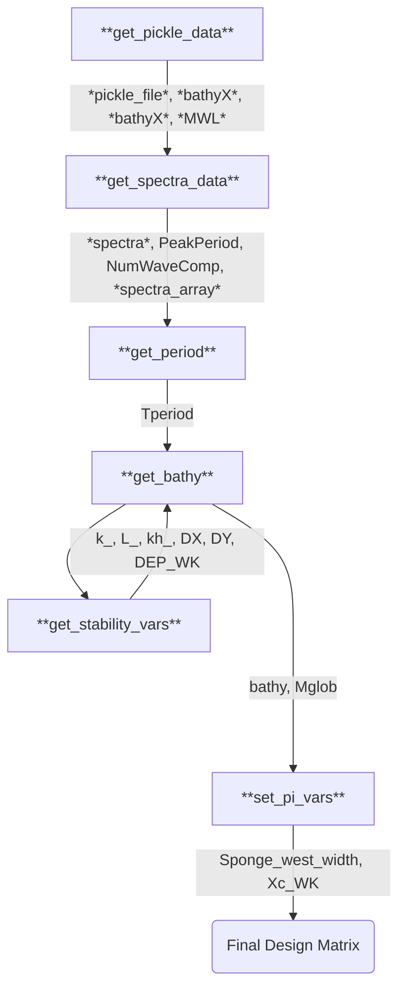
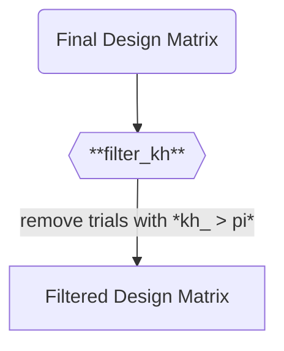

# DUNE 3: T1 Design Matrix

## Input Parameters and Preprocessing
### Custom Input Design Parameters
- **pi_1**: position of the wavemaker from the western edge, in multiples of the representative wavelength lambda
- **pi_2**: width of the sponge layer, in multiples of the representative wavelength lambda
- **D3_trial**: number of Dune 3 Trial, from 5 to 24
### Custom Input Support Parameters
- **DATA_DIR**: Directory where each pickled input file is stored
- **WG_to_use**: index of the wavegauge to use in Dune 3 dataset
- **lo**: Lowest frequency to allow for generated spectra
- **hi**: Highest frequency to allow for generated spectra
### Ranged Parameters
- **D3_trial**: number of Dune 3 Trial, from 5 to 24

## Data Sources
## Preprocessing Pipeline

### Custom Dependent Parameters
- *pickle_file*: path to the .pkl file for the Dune 3 data for the given trial
- *bathyX*: 1D array for the X bathyemtry
- *bathyZ*: 1D array for the bathymetry depth 
- *MWL*: mean water level
- *spectra*: dictionary struct containing spectra information
- *spectra_array*: array containing a 1D spectra with period in column 1 and amplitude in column 2
- *k_*: wave number 
- *kh_*: kh for the trial

## Filter Functions

## Plots generated

## Input Files Printed
- **input.txt**
- **bathymetry**
- **spectra**:

## Postprocessing
### Outputs Condensed
All outputs specified in input.txt
### Postprocessing Functions Applied

### Plots/Videos Generated