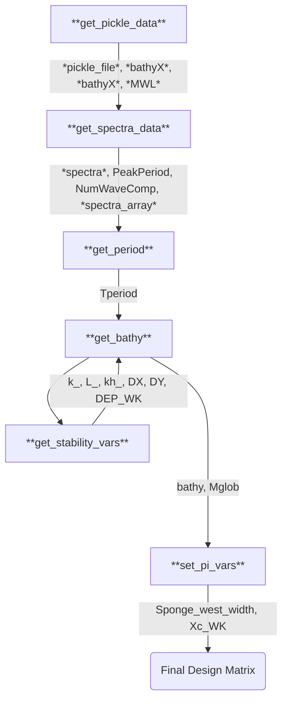
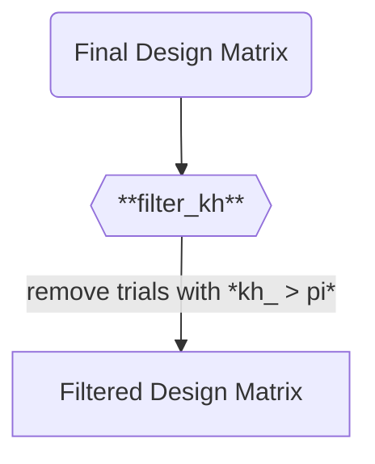

# Dune 3: T01 Design Matrix

## Summary
This is a rehash of the FUNWAVE design matrix used for validating FUNWAVE against the Dune 3 dataset, where the results were shown to Tom on 10/3/2024 in the really big powerpoint. Writing up documentation on 10/4/2024. The validation for this was pretty good, but this was really just the first attempt.

## Key FUNWAVE Information

| | |
|:---|:----|
| **Modules** | Core module, no flags |
| **Wavemaker Type** | WK_TIME_SERIES |
| **Bathymetry Type** | DEP_FILE |
| **Sponge Type**| Direct, Friction |
| **Roller** | True |
| **VISCOSITY_BREAKING** | True |
| **Data Format** | Binary|
| **Periodic?** | No |
| **Dimensionality** | 1D |

## Description of Custom Parameters
### Custom Input Parameters
* `pi_1`: Position of the wavemaker from the western edge of the model domain in multiples of some representative wavelength $\lambda$ (`L_`)
- `pi_2`: Width of the sponge layer in in multiples of some representative wavelength $\lambda$ (`L_`)
- `D3_Trial`: Trial to pull data from in the Dune 3 dataset, from 5-24
- `DATA_DIR`: Directory where each pickled input file is stored.
- `WG_to_use`: index of the wavegauge to use in Dune 3 dataset
- `lo`: Lowest frequency to permit in the spectra of inputs (Hz)
- `hi`: Highest frequency to permit in the spectra of inputs (Hz)
### Ranged Parameters
- **D3_trial**: number of Dune 3 Trial, from 5 to 24 (go through all the trials)

### Custom Dependent Parameters
- `pickle_file`: path to the .pkl file for the Dune 3 data for the given trial
- `bathyX`: 1D array for the X bathyemtry
- `bathyZ`: 1D array for the bathymetry depth 
- `MWL`: mean water level
- `spectra`: dictionary struct containing spectra information
- `spectra_array`: array containing a 1D spectra with period in column 1 and amplitude in column 2
- `k_`: wave number 
- `kh_`: kh for the trial

## Preprocessing Pipeline
The basic idea is to process the spectral data first, so we can get a representative wavelength/period from peak of the spectra. Then, the bathymetry can be interpolated to a grid consistent with the FUNWAVE stability limits for DX, which are in terms of some wavelength $\lambda$. Finally, the wavemaker position and sponge widths are set.
### Calculating Dependent Parameters

### Filter functions
The only filter used is the condition that $kh <\pi$, to ensure model applicability. The Dune 3 trials are all very clearly shallow water anyways.

## Explanatory Notes
