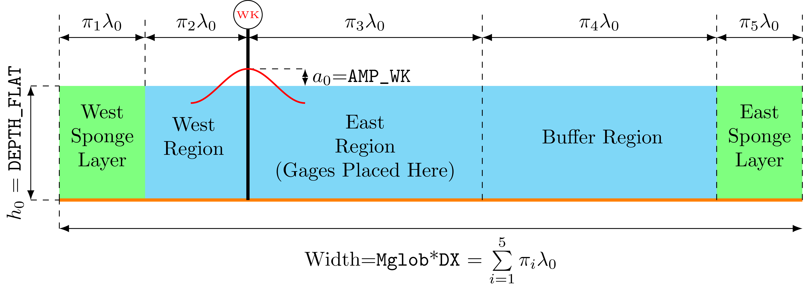

# Empty Tank Energy Analysis

**NOTE**: This is intended to be a general overview of the process, with a bit more detail that I usually document for myself to explain the FUNWAVE_DS module in context a bit better. More fully fledged documentation is under development.

## Domain and Forcing Description
### Physical Regions of the Domain



FUNWAVE-TVD is run in `DEPTH_TYPE=FLAT` mode with a regular wavemaker `WAVEMAKER = WK_REG` under a given period and amplitude, as shown in the figure above. The wavemaker is placed some distance from the left edge of the domain. The primary interest is the behavior of the regular wavetrain as it propagates *eastward* in the domain. 

Consistent with FUNWAVE-TVD best practices, sponge layers are placed on each end of the domain to dampen wave energy and reflections that may otherwise occur.

Since the primary interest is the behavior as the wave propagates eastwards, wave gauges are placed in the region labeled **East Region** at regular spacing. Beyond this region and before the sponge, an additional region is placed as a **Buffer Region** where waves can propagate uninhibited by the sponge. The western side of the domain is constructed such that the wavetrain can be generated without interference from the western sponge region. Because of this, there is some non-sponge region left of the wave maker labeled the **West Region**, where there are similarly no gages.

### Representative Wavelength
The width of these regions is set dynamically for each wave condition, based on a **representative wavelength** $\lambda_0$. This wavelength is calculated from the linear dispersion relationship for the input period `Tperiod` of the wavemaker and the depth `DEPTH_FLAT` of the domain:

$$
\sigma^2 = gk\tanh{kh}
$$

where:
- $\sigma=\frac{2\pi}{T}$: the intrinsic angular frequency, which is just related to the period `Tperiod` for this setup
- $h$: the depth of water, taken as `DEPTH_FLAT` in this setup
- $g$: gravity (9.81 m/s^2)

The representative wavelength is then taken as:

$$
\lambda_0 = \frac{2\pi}{k}
$$

Note that this is technically rounded to the nearest integer (see ) to make the numbers a bit nicer.

### Representative Wavelength
The width of these regions is set dynamically for each wave condition, based on a **representative wavelength** $\lambda_0$. This wavelength is calculated from the linear dispersion relationship for the input period `Tperiod` of the wavemaker and the depth `DEPTH_FLAT` of the domain:

$$
\sigma^2 = gk\tanh{kh}
$$

where:
- $\sigma=\frac{2\pi}{T}$: the intrinsic angular frequency, which is just related to the period `Tperiod` for this setup
- $h$: the depth of water, taken as `DEPTH_FLAT` in this setup
- $g$: gravity (9.81 m/s^2)

The representative wavelength is then taken as:

$$
\lambda_0 = \frac{2\pi}{k}
$$

Note that this is technically rounded to the nearest integer (see ) to make the numbers a bit nicer.


### Representative Wavelength
The width of these regions is set dynamically for each wave condition, based on a **representative wavelength** $\lambda_0$. This wavelength is calculated from the linear dispersion relationship for the input period `Tperiod` of the wavemaker and the depth `DEPTH_FLAT` of the domain:

$$
\sigma^2 = gk\tanh{kh}
$$

where:
- $\sigma=\frac{2\pi}{T}$: the intrinsic angular frequency, which is just related to the period `Tperiod` for this setup
- $h$: the depth of water, taken as `DEPTH_FLAT` in this setup
- $g$: gravity (9.81 m/s^2)

The representative wavelength is then taken as:

$$
\lambda_0 = \frac{2\pi}{k}
$$

Note that this is technically rounded to the nearest integer (see ) to make the numbers a bit nicer.

### $\pi$ Parameters: Setting the Physical Domain Dynamically
The width of each layer is dynamically set as some multiple of the the wavelength $\lambda_0$ based on the objectives of this study and FUNWAVE-TVD best practices. These are set by the non-dimensional $\pi$ groups, which define how many wavelengths thick each layer is:

|Layer|$\pi$ |Value|Rationale|
|:--|:--|:--|:--|
|West Sponge Layer|$\pi_1$|4| Torres (2022)- should be $\geq1\lambda_0$ |
|West Region|$\pi_2$|1| Torres (2022)- distance b/w sponge and wavemaker should be $\geq1\lambda_0$|
|East Region|$\pi_3$|50| Long enough to examine wave statistics as a function of distance|
|Buffer Region|$\pi_4$|100| Long enough to be far from the sponge |
|East Sponge Layer|$\pi_5$|4| Torres (2022)- should be $\geq1\lambda_0$|

### $\tau$ Parameters: Setting the Temporal Domain Dynamically
Nondimensional times are set by $\tau$ parameters, which represent multiples of the some characteristic period $T_0$. Note that for the regular wavemaker, the clear characteristic period to use is just `Tperiod`. 

$$
\text{Time Scale} = \tau T_0 = \tau \texttt{Tperiod}
$$

There is only one time-variable explicitly set in this study- `TOTAL_TIME`. This was originally set as 150, but has been expanded to 300 to cover more wave periods.
|Time Scale|$\tau$ |Value|Rationale|
|:--|:--|:--|:--|
|Total Simulation Time|$\tau_1$|300| Enough to get a steady state|

Thus,  $\texttt{TOTAL TIME}=\tau_1\texttt{Tperiod}$ with $\tau_1=300$

### $\xi$ Parameters: Setting Hydrodynamic Parameters Dynamically
It also may make sense to set some parameters based on hydodynamic constraints. For example, the classic nonlinearity parameter $\epsilon=a/h$ or the classic depth parameter $\mu=kh$ may be of explicit interest. These are set by $\xi$ parameters.

In this study, we only use the nonlinearity parameter $\epsilon=a/h$ to dynamically set the amplitude:

|Parameter|$\xi$ |Value|Rationale|
|:--|:--|:--|:--|
|$\epsilon=\frac{a}{h}$|$\xi_1$|0.05| Very linear waves, at least at generation|

Thus the amplitude is set as $\texttt{AMP WK}=\xi_1\texttt{DEPTH FLAT}$


## Preprocessing with FUNWAVE_DS

### Input Variables from Prior Analysis
The test suite mirrors relies on a former project, with parameters provided in the Excel spreadsheet [`simulation_test_bed_REG_v3.xlsx`](./excel/simulation_test_bed_REG_v3.xlsx). 

Note that not all of the combinations of variables in this spreadsheet are used! Rather, **every third** row is used, since 3 different values of `DX` were tested in this previous project. This corresponds to the median `DX` of each trio of simulations.

**Only the `Tperiod`, `DEPTH_FLAT ` and `DX` values are used**. The values of this have been saved to a `.parquet` file in the [data](../data/) directory.

### The Design Matrix 
A **design matrix** is specified for this model suite, which is viewable at the [/design_matrices](./design_matrices/A2.csv) directory under the run name A2. Within this spreadsheet, there are a few different types of parameters:
- **Constant parameters**: Are specified with a name in the *VAR* column and a single value in the **CON** column
- **Varied parameters**: Variables that are modified between model runs
    - **Input parameters**: values that are explicitly input. Here, we just have `Tperiod`, `DX` and `DEPTH_FLAT`, They are denoted as `INPUT` on the design matrix sheet. Once parsed, they are constant values.
    - **Dynamic parameters**: variables that are calculated "on the fly" from user-defined functions. They are denoted as `DYNAMIC` in the input sheet. Once calculated, they are constant values
    - **Ranged parameters**: variables that span between a user specified range. Here, the only ranged parameter is `sim_number`. The `LO` column corresponds to the lower bound, `HI` the higher bound, and `NUM` the number of points, effectively serving as a `np.linspace()`

### Combinations of Variables
The function `process_design_matrix_NC()` reads the design matrix to automatically consider every possible combinations of input parameters. Here, we only have 216 different cases. But say, for example, we wanted to test 3 different `DX` values. By treating `DX` as a ranged parameter, it would automatically consider all $216 \times 3 = 648$ combinations of variables.

### Pipelines
For each combination of variables, the function runs a user defined **pipeline** to calculate variables on the fly. The functions for this are defined in a directory [`./model_code`](./model_code/). There are some general rules to the form of these functions:
- The signature of the function is always of the form `get_input_vars(var_dict)`.
- The function always returns a dictionary of values that should be added to the `input.txt` file.
- Any pipeline function later in the pipeline now has access to these new variables.


The pipeline used for this run has the following form:

```
function_sets = {'Standard' : [mod.get_input_vars,
                               mod.get_hydro,
                               mod.set_domain,
                               mod.set_stations]}
```
The pipeline itself has a name (Standard) and a list of functions defined by a list. The list logically goes in order of the tasks that need to be done:
1. [`get_input_vars`](./model_code/get_variables.py): From the parquet of input information, we need to access the period, depth, and DX value
2. [`get_hydro`](./model_code/hydro.py): Several of our parameters are based on representative wavelengths. We need to calculate and add those.
3. [`set_domain`](./model_code/set_domain.py): Now with all of the information needed, we can actually set parameters like the wavemaker distance and sponge width in terms of other parameters.
4. [`set_stations`](./model_code/set_stations.py): This sets the positions of stations.

This is necessarily an ordered list, and each function adds more information to the pile that the next one can use. Dictionary syntax is used to make things simple.

#### Example: `get_input_vars`
For example, let's look at `get_input_vars`, which is the first step:

```python
def get_input_vars(var_dict):
    # Unpack Variables---------------------------
    DATA_PATH = var_dict['DATA_PATH']
    SIM_NUMBER = var_dict['SIM_NUMBER']
    #--------------------------------------------
    print('\t\tStarted accessing input variables...')

    # Load in Parquet and index out sim number row
    df = pd.read_parquet(DATA_PATH)
    df = df[df['SIM_NUMBER']==SIM_NUMBER]
    
    # Get variables of interest
    Tperiod = float(df['Tperiod'].values[0])
    DEPTH_FLAT = float(df['DEPTH_FLAT'].values[0])
    DX = df['DX'].values[0]

    # Return
    print('\t\tSuccessfully got input variables!')
    return {'Tperiod': Tperiod,
            'DEPTH_FLAT': DEPTH_FLAT,
            'DX': DX
            }
```

Here, we get the path to the parquet containing the inputs (this was a constant paramter) and the sim number (which was ranged, so it will vary). What we need to do is load in the parquet and find the correct row. Then, the 3 values of interest can be extracted. Finally, they are output as a dictionary. 

Importantly, the dictionary **must** be valid FUNWAVE names if they are to be used in the simulation! This is THE `Tperiod` that will ultimately end up in the `input.txt` file. 

With these parameters now obtained, the `get_hydro()` function has what it needs. The first few lines of this are:

```python
def get_hydro(var_dict):
    # Unpack Variables-------------------------------------------------
    Tperiod = var_dict['Tperiod']
    DEPTH_FLAT = var_dict['DEPTH_FLAT']
    # REST OF FUNCTION
```

where we now have access to these variables. Note there is some additionally complexity in setting up the Domain object, (see documentation coming, but also [set_domain](./model_code/set_domain.py)). 

### The Generation Script
With a valid pipeline defined, the generation script can now be run. It essentially relies on the one function `process_design_matrix_NC` with many arguments:

```python
import funwave_ds.fw_py as fpy   # Basic functionality
import funwave_ds.fw_fs as fs    # Common function set tools
import model_code as mod         # Model specific code

# Define the design matrix
matrix_file = '/work/thsu/rschanta/RTS-PY/fw_models/USACE_Empty_Tank/A2/design_matrices/A2.csv'

# Pipeline: Get bathy_df, make stable
function_sets = {'Standard' : [mod.get_input_vars,
                               mod.get_hydro,
                               mod.set_domain,
                               mod.set_stations]}


# Plot functions
plot_functions = []

# Filter functions
filter_functions = []

# Print functions
print_functions = [fs.print_stations]


# Write the files
fpy.process_design_matrix_NC(matrix_file, 
                function_sets = function_sets, 
                filter_sets = filter_functions,
                plot_sets = plot_functions,
                print_sets = print_functions)

print('File Generation Script Run!')
```

In addition to the pipeline, there are also options for 3 additional function sets:

- **Plot functions**: functions to generate a `.png` output of some kinds. Most commonly, a diagram of the problem domain or the input wave spectra. Here, there is nothing plotted alongside the inputs

- **Filter functions**: Obviously, not all combinations of any random parameters will be valid! We might want to allow depths to range between 1-20 while also letting periods to vary between 2-16. But a water depth of 10 meters with a 2 second period generates a wave well outside of the FUNWAVE validity range, since $kh\approx10>\pi$. Rather than generating this input case that will produce meaningless or unstable results, **filter** functions can be created to exclude such cases. For example, a filter to automatically exclude cases where $kh>\pi$ could be implemented. Here, this work was already done so this was left blank.

- **Print functions**: Functions to print besides a `input.txt` file that a FUNWAVE-TVD model needs to run. This is most commonly a `gages.txt`, `bathy.txt` or `wave_comp_file.txt`. Whereas plot functions just output something to some path, print functions also add this path to the `input.txt` file generated, since the model needs this path to actually tun.

### Final Notes
Note that running this file actually involves a bit more setup that indicated here, notably via the specification of environment variables such that the script knows where to save things. But the end result ends up being a folder that looks like this:
```
A2
| bathy
| inputs
    - input_00001.txt
    - input_00002.txt
    ...
    - input_000216.txt
|outputs-raw
|spectra
| st
    - st_00001.txt
    - st_00002.txt
    ...
    - input_000216.txt
```

Inputs are saved to the `inputs` folder, and station files to `st`. If custom bathymetry/spectra existed, those would also be saved to the corresponding directories. When run, the FUNWAVE model will drop all the raw data (ie- `RESULT_FOLDER`) to a subdirectory of `outputs-raw` for each run.