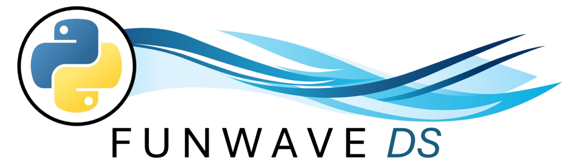

# FUNWAVE_DS Module

## Summary
The `FUNWAVE_DS` python module contains functionality to create, run, and post-process large ensembles of FUNWAVE-TVD models in either local or high performance computing (HPC) environments. Its functionality includes but is not limited to:

- Creation of `input.txt` files for model runs from user-input `.csv` files and user-defined preprocessing piplines.
- Creation of job-scheduling scripts for HPC systems to run FUNWAVE-TVD models in parallel
- Compression of raw FUNWAVE-TVD outputs (ie- the contents of `RESULT_FOLDER`) to serialized NetCDF formats.
- Automation of the animation of output variables over the model domain
- Posprocessing functionality to calculate wave statistics, make comparisons to field data, or generate plots.

## Contents
The `FUNWAVE_DS` module itself is a Python module under the `funwave_ds` directory. However, some addition functionality is included in this repo:
- [./funwave](./funwave/): Contains slight modifications to the FUNWAVE-TVD source code to work well with the Python module. Only file i/o modifications are modified- no core functionality is altered in any way.
- [./fw_models](./funwave_ds/): A working directory containining implementations of model ensembles created and managed by the `FUNWAVE_DS` module. 

## Dependencies
The `FUNWAVE_DS` module is Python-3 based, with a list of required modules found in the [requirement.txt](./funwave_ds/requirements.txt) file. (Note that the containerization of this is still a work in progress). Additionally, it is assumed that the user has all necessary FORTRAN compilers to run the FUNWAVE-TVD model, which inlcudes OpenMPI for parallelized code implementations.

## Contact
This repository was created and managed by Ryan Schanta (rschanta@udel.edu) at the Center for Applied Coastal Reseach. FUNWAVE-TVD source-code is used as per the Simplified BSD license agreement found in `.F` source files.